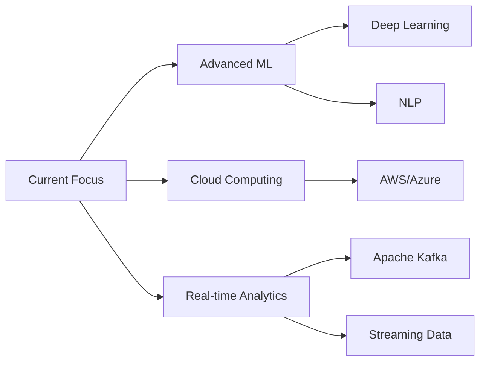

<div align="center">

# 👋 Hi, I'm Vaseem Manchuri

### Data Science Enthusiast | Automation Expert | Problem Solver


[](https://www.linkedin.com/in/manchuri-vaseem-bb3250233)
[](https://github.com/vaseem3112)
[](mailto:vaseem3112@gmail.com)
[](https://vaseem3112.github.io/portfolio/)

</div>

---

## 🚀 About Me

```python
class VaseemManchuri:
    def __init__(self):
        self.location = "Pileru, Andhra Pradesh, India"
        self.education = "B.Tech in Data Science"
        self.current_focus = ["Data Analytics", "Automation", "Machine Learning"]
        self.looking_for = "Data Science & Analytics Opportunities"
        
    def get_skills(self):
        return {
            "languages": ["Python", "SQL"],
            "analytics": ["Excel", "Tableau", "Power BI", "Pandas", "NumPy"],
            "automation": ["Automation Anywhere A360", "Salesforce Flows"],
            "ml_ai": ["Scikit-learn", "Content-Based Filtering", "Recommendation Systems"],
            "tools": ["Jupyter", "Git", "Streamlit", "APIs", "OCR"],
            "platforms": ["Salesforce Service Cloud", "GitHub", "Tableau Public"]
        }
    
    def say_hi(self):
        print("Thanks for dropping by! Let's build something amazing together!")

me = VaseemManchuri()
me.say_hi()
```

---

## 💼 Professional Experience

<table>
<tr>
<td width="60%">

### 🏢 Associate Support Engineer
**Conduent Pvt Ltd** | *Apr 2025 - Aug 2025*

- ⚡ Maintained **99%+ uptime** for Salesforce Service Cloud
- 🤖 Reduced manual work by **40%** through automation
- 📊 Improved data accuracy by **30%**
- 👥 Served **500+ daily active users**

</td>
<td width="40%">


</td>
</tr>
</table>

---

## 🎯 Featured Projects

<div align="center">

<table>
<tr>
<td width="50%" valign="top">

### 📊 Automated Student Performance Analytics


**End-to-end analytics solution** transforming raw data into automated insights

- ✅ Processed **1000+ student records**
- ✅ **95% data quality** improvement
- ✅ Reduced reporting time from **2 hours → 10 minutes**

[View Project →](https://github.com/vaseem3112/student-analytics)

</td>
<td width="50%" valign="top">

### 🤖 RPA Invoice Processing System


**Intelligent automation** with OCR and error handling

- ✅ **98% accuracy** in data extraction
- ✅ **87% time reduction** (2hrs → 15min)
- ✅ Automated email notifications

[View Project →](https://github.com/vaseem3112/rpa-invoice)

</td>
</tr>

<tr>
<td width="50%" valign="top">

### 🎵 Music Recommendation System


**ML-powered** music recommendations with Spotify API

- ✅ **1000+ songs** database
- ✅ **<2 second** response time
- ✅ Content-based filtering with cosine similarity

[View Project →](https://github.com/vaseem3112/music-recommender)

</td>
<td width="50%" valign="top">

### 🚀 More Projects Coming Soon!
I'm constantly learning and building new projects. Check back regularly for updates!

**Current Focus:**
- Advanced ML models
- Real-time data pipelines
- Cloud-based analytics solutions

</td>
</tr>
</table>

</div>

---

## 🛠️ Tech Stack

<div align="center">

### Languages & Analytics


### Libraries & Frameworks


### Tools & Platforms


</div>

---

## 📊 GitHub Statistics

<div align="center">
  


</div>

<div align="center">
  


</div>

---

## 🏆 Achievements & Certifications

<div align="center">

| 🎓 Certification | 🏢 Organization |
|:---|:---|
| 🐍 Python for Data Science | Cognitive Class |
| ✈️ Data Science Virtual Experience | British Airways |
| 📊 Power BI Virtual Case Experience | PwC Switzerland |
| 🎖️ Appreciation Certificate | Zilla Parishad High School, Muthirevula |

</div>

---

## 📈 Impact By Numbers

<div align="center">

```text
📊 Data Quality Improvement    ████████████████████░ 95%
⚡ Process Automation          ████████████████████░ 92%
🎯 System Reliability          ████████████████████░ 99%+
🤖 ML Model Accuracy           ████████████████████░ 98%
```

<table>
<tr>
<td align="center">
<h3>1000+</h3>
<p>Records Processed</p>
</td>
<td align="center">
<h3>40%</h3>
<p>Efficiency Boost</p>
</td>
<td align="center">
<h3>500+</h3>
<p>Users Served</p>
</td>
<td align="center">
<h3>3+</h3>
<p>Major Projects</p>
</td>
</tr>
</table>

</div>

---

## 💡 What I'm Currently Learning

<div align="center">



</div>

- 🧠 Advanced Machine Learning algorithms
- ☁️ Cloud platforms (AWS, Azure)
- 📡 Real-time data streaming & processing
- 🤖 Deep Learning & Neural Networks
- 📊 Advanced data visualization techniques

---

## 🤝 Let's Connect!

<div align="center">

I'm always excited to collaborate on interesting projects or discuss opportunities in data science and analytics!

### 📫 Reach Out To Me

[](https://linkedin.com/in/VASEEMMANCHURI)
[](mailto:vaseemanchuri@gmail.com)
[](https://your-portfolio-url.com)

### 📍 Location
**Pileru, Andhra Pradesh, India** 🇮🇳

### 📞 Phone
**+91 9100288408**

---


<sub>⭐️ From [vaseem3112](https://github.com/vaseem3112) | Last Updated: January 2026</sub>

</div>
